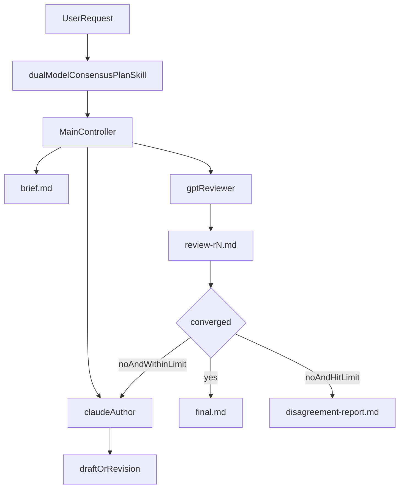

# 双模型共识工作流-计划制定

## 目的

这套工作流用于把“开发计划制定”类输出拆成三个稳定角色：

- `Claude` 负责生成与修订主 Markdown 计划文档
- `GPT` 负责 review 当前版本，并输出修改计划
- 主控制器负责编排轮次、保存文件、判断收敛或停机

目标不是让两个模型同时写计划，而是让一个模型负责产出，一个模型负责挑错，再由产出方吸收或反驳意见，直到收敛。

## 何时使用

仅在你显式要求使用这套流程时启用，例如：

- `使用双模型共识工作流-计划制定生成开发计划`
- `用双模型共识流程制定这个需求的实施计划`
- `让 Claude 起草计划，GPT review，直到一致`

默认情况下，不会自动拦截所有普通计划请求。

## 工作流资源

接入到项目后，相关文件应位于：

- Skill: `.cursor/skills/dual-model-consensus-plan/SKILL.md`
- 参考规范: `.cursor/skills/dual-model-consensus-plan/reference.md`
- Prompt 模板:
  - `.cursor/prompts/dual-model-consensus-plan/claude-analysis-planner.md`
  - `.cursor/prompts/dual-model-consensus-plan/gpt-review.md`
  - `.cursor/prompts/dual-model-consensus-plan/claude-revision.md`
  - `.cursor/prompts/dual-model-consensus-plan/disagreement-report.md`
- 项目级 subagent:
  - `.cursor/agents/claude-author.md`
  - `.cursor/agents/gpt-reviewer.md`

## 目录约定

`.cursor/plans/` 根目录可以同时包含两类内容：

- 普通计划文档
- 以 `<topic-slug>/` 命名的 workflow 运行目录

真正的双模型共识运行产物必须放在 `.cursor/plans/<topic-slug>/` 下。

```text
.cursor/plans/<topic-slug>/
  brief.md
  draft-r1.md
  review-r1.md
  response-r2.md
  revision-r2.md
  review-r2.md
  response-r3.md
  revision-r3.md
  review-r3.md
  final.md
  disagreement-report.md
```

只创建本次运行真正需要的文件。

## 架构与职责



职责边界：

- `skill` 负责触发条件、所需输入、流程约束
- `claude-author` 只负责首稿或修订，不负责决定是否继续下一轮
- `gpt-reviewer` 只负责 review 和修改计划，不直接重写主文档
- 主控制器负责状态机、文件流转、收敛检查、轮次上限和最终停机

## 标准执行路径

### 1. 准备输入

控制器需要 3 个输入：

- `user task`
- `topic slug`
- `max rounds`，默认 `3`

该工作流固定输出 `plan` 制品。

如果用户没给 `topic slug`，控制器应从任务语义推导一个简短的 kebab-case 名称。

### 2. 写入 `brief.md`

`brief.md` 记录：

- 原始任务
- 标准化后的任务描述
- 产物类型，固定为 `plan`
- 主题 slug
- 最大轮次
- 执行模式：`automatic` 或 `manual-fallback`
- 模型绑定备注：如果某一轮因模型未按预期命中而重跑，要记录在这里

### 3. Claude 生成首稿

控制器使用 `claude-analysis-planner.md` 渲染首轮 prompt，并调用 `claude-author`。

保存规则：

- 只保存主文档正文
- 文件名固定为 `draft-r1.md`

### 4. GPT 执行 review

控制器使用 `gpt-review.md` 渲染评审 prompt，并调用 `gpt-reviewer`。

保存规则：

- 只保存 review 正文
- 文件名固定为 `review-r1.md`

### 5. 执行收敛检查

每轮 GPT review 后，控制器都必须检查：

1. `status: acceptable`
2. `blocking-issues: 0`
3. 最新主文档没有 `TODO`、`TBD`、`待确认` 等未处理占位
4. 如果是第 1 轮直接通过，则可直接生成 `final.md`
5. 否则，Claude 的最新 `response-rN.md` 必须逐条回应上一轮 findings

### 6. Claude 修订

若未收敛且未达到轮次上限，控制器使用 `claude-revision.md` 渲染修订 prompt，并再次调用 `claude-author`。

这一步必须拆成两个文件：

- `response-rN.md`：Claude 对上一轮 review 的逐条响应
- `revision-rN.md`：干净的修订后主文档

注意：

- 下一轮 GPT 只能 review `revision-rN.md`
- 不能把 `response-rN.md` 作为评审对象
- 控制器应按固定哨兵拆分 Claude 输出：`<!-- BEGIN_RESPONSE -->`、`<!-- END_RESPONSE -->`、`<!-- BEGIN_REVISION -->`、`<!-- END_REVISION -->`
- 哨兵只用于控制器拆分，不进入最终保存的 `response-rN.md` 和 `revision-rN.md`

### 7. 终止条件

收敛时：

- 只把最新主文档正文写入 `final.md`

达到最大轮次仍未收敛时：

- 使用 `disagreement-report.md` 模板生成 `disagreement-report.md`
- 渲染模板时必须传入：最新主文档、最新 review、最新 Claude 响应、历史 review 列表、历史 Claude 响应列表
- 如果尚未发生 Claude 修订轮次，则 `LATEST_CLAUDE_RESPONSE` 和 `CLAUDE_RESPONSE_HISTORY` 统一传 `none`
- 同时保留最新主文档作为人工继续判断的基础，它可能是 `draft-r1.md`，也可能是最新 `revision-rN.md`

## 自动路径

推荐优先使用“单会话控制器自动调度”：

1. 用户显式要求启用双模型共识工作流-计划制定
2. 主控制器收集输入并写入 `brief.md`
3. 控制器在每一轮显式调用 `claude-author` 或 `gpt-reviewer`
4. 控制器检查是否收敛或达到上限
5. 输出 `final.md` 或 `disagreement-report.md`

这条路径适合：

- 希望自动推进轮次
- 希望把文件命名、收敛判断、停机逻辑固定下来
- 希望在单次会话内完成整个流程

## 手动回退路径

如果某些运行模式下 subagent 的模型绑定没有按预期生效，则需要保留手动回退路径。

当你怀疑本轮没有使用到预期模型时：

1. 保持相同的文件结构和轮次规则
2. 仍然由主控制器负责写 `brief.md`，并按同一契约保存 `draft-r1.md`、`review-rN.md`、`response-rN.md`、`revision-rN.md`、`final.md` 或 `disagreement-report.md`
3. 显式点名要调用的 subagent
4. 必要时由人手动切换当前模型后，再重新执行该轮
5. 在 `brief.md` 的模型绑定备注中记下发生了哪一轮 fallback，以及如何重跑

不要因为模型绑定失效就改掉整个工作流结构。回退的只是“谁来执行这一轮”，不是“文件契约和停机规则”。

## 最小触发示例

```text
请使用双模型共识工作流-计划制定处理下面这个任务：

任务：为一个新的 API 网关功能生成开发计划
主题：api-gateway-rollout
最大轮次：3
```

## 文件职责

- `brief.md`：任务与运行参数的标准化快照
- `draft-r1.md`：Claude 首稿
- `review-rN.md`：GPT 第 `N` 轮 review
- `response-rN.md`：Claude 对上一轮 review 的逐条响应
- `revision-rN.md`：Claude 第 `N` 轮修订后的干净正文
- `final.md`：收敛后的最终版本
- `disagreement-report.md`：超轮次后的人工裁决材料

## 收敛与停机

只有同时满足以下条件，才能认为流程收敛：

1. 最新 `review-rN.md` 的 verdict 为 `acceptable`
2. 最新 review 中 `blocking-issues: 0`
3. 最新主文档没有未处理占位
4. 若不是首轮直接通过，则最新 `response-rN.md` 已回应上一轮所有问题

默认最大轮次是 `3`，轮次按 `review-rN.md` 计数，而不是按 Claude 修订次数计数。

## 实践建议

- 让 GPT 专注于“找错”和“给修改计划”，不要让它接管主文档
- 让 Claude 专注于“更新主文档”和“解释取舍”，不要让它兼任 reviewer
- 每轮都保留历史文件，避免只覆盖一个 `current.md`
- 同一分歧如果连续两轮反复出现，应优先人工介入
- 若采用 subagent，请始终由控制器显式传入完整上下文，不要假设 subagent 能看到前文
